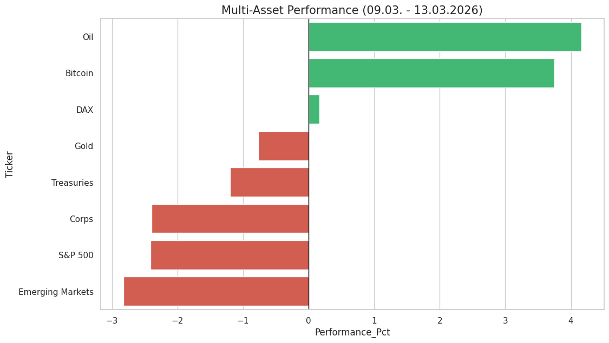

# 📈 Multi-Asset Weekly Wrap-up

Dieses Projekt analysiert automatisch die Performance und das Risiko globaler Assetklassen.

## 🚀 Aktueller Wochenrückblick (2026-02-13)

### 🛡️ Risiko-Analyse
Der Risiko-Status vergleicht die aktuelle Bewegung mit der historischen Volatilität der letzten 90 Tage.

| Asset | Performance | Risiko-Status |
| :--- | :--- | :--- |
| Treasuries | +1.17% | ⚠️ Extrem |
| Emerging Markets | +1.01% | ✅ Stabil |
| Corps | +0.93% | ⚠️ Extrem |
| DAX | -0.40% | ✅ Stabil |
| Gold | -0.57% | ✅ Stabil |
| Bitcoin | -1.80% | ✅ Stabil |
| S&P 500 | -1.85% | 🔄 Volatil |
| Oil | -2.28% | ✅ Stabil |

---
*Automatisch aktualisiert am 20.02.2026 um 20:40*
