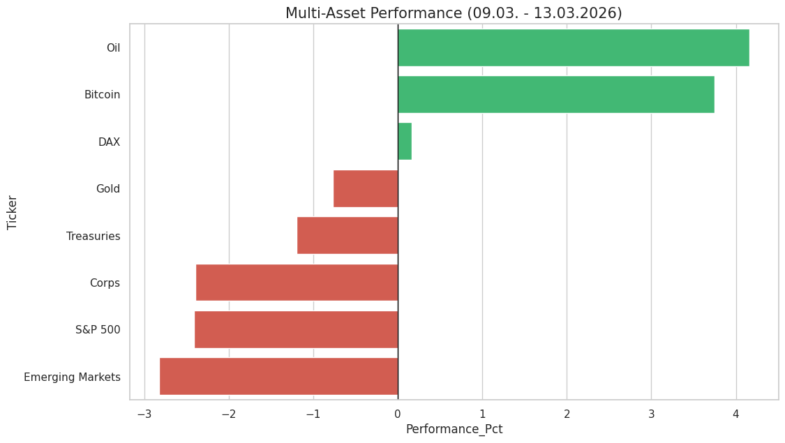

# 📈 Multi-Asset Weekly Wrap-up

## Aktueller Wochenrückblick (2026-03-27)

### Markt-Kontext & Analyse
| Asset | Performance | Trend (4W) | Risiko-Status |
| :--- | :--- | :--- | :--- |
| Oil | +14.81% | ➡️ | ⚠️ Extrem |
| Gold | +2.66% | ➡️ | ✅ Stabil |
| Treasuries | -0.61% | ➡️ | 🔄 Volatil |
| Corps | -0.87% | ➡️ | 🔄 Volatil |
| DAX | -1.56% | ➡️ | ✅ Stabil |
| S&P 500 | -3.22% | ➡️ | ⚠️ Extrem |
| Emerging Markets | -3.68% | ➡️ | 🔄 Volatil |
| Bitcoin | -6.90% | ➡️ | 🔄 Volatil |

---
*Automatisch aktualisiert am 27.03.2026 um 22:00*
