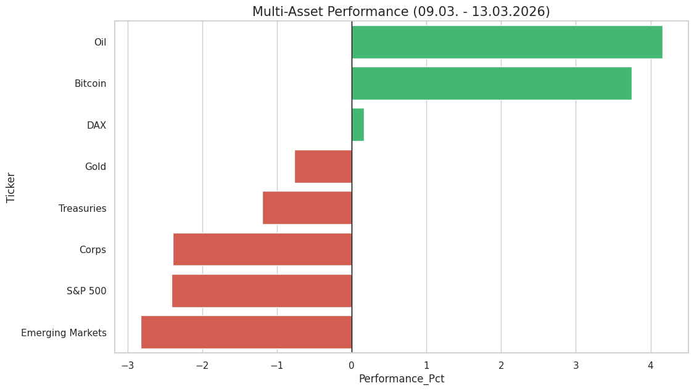

# 📈 Multi-Asset Weekly Wrap-up

## Aktueller Wochenrückblick (2026-07-03)

### Markt-Kontext & Analyse
| Asset | Performance | Trend (4W) | Risiko-Status |
| :--- | :--- | :--- | :--- |
| DAX | +3.87% | ➡️ | 🔄 Volatil |
| Gold | +2.25% | ➡️ | ✅ Stabil |
| Bitcoin | +2.24% | 📉 | ✅ Stabil |
| S&P 500 | +0.58% | ➡️ | ✅ Stabil |
| Corps | -0.62% | ➡️ | ✅ Stabil |
| Treasuries | -0.66% | ➡️ | 🔄 Volatil |
| Emerging Markets | -2.57% | ➡️ | ✅ Stabil |
| Oil | -2.91% | ➡️ | ✅ Stabil |

---
*Automatisch aktualisiert am 03.07.2026 um 22:02*
